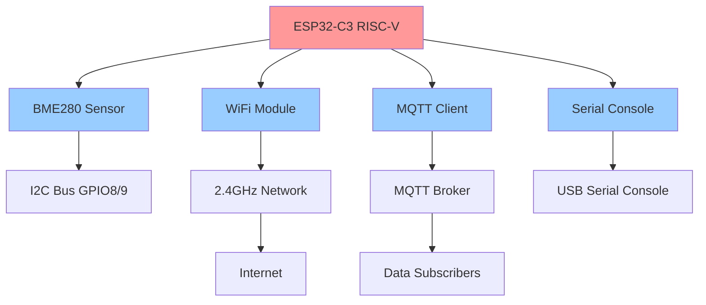

# TI0162 - Internet of Things Project

> Complete ESP32-C3 IoT Environmental Monitoring System for Academic Course

[](https://www.rust-lang.org)
[](https://www.espressif.com/en/products/socs/esp32-c3)
[](https://embassy.dev)
[](https://www.ufc.br)

A complete and functional IoT system developed for the **TI0162 Internet of Things** course at Universidade Federal do Ceará (UFC). This project implements environmental data collection via BME280 sensor, WiFi connectivity, and MQTT transmission using Rust and the Embassy async framework on ESP32-C3 hardware.

## 🎯 Project Overview

This academic project demonstrates practical IoT system development with modern embedded Rust, showcasing:

- **Modular Architecture**: Clean separation between drivers, core infrastructure, and applications
- **Real Hardware Validation**: Tested on actual ESP32-C3 with BME280 sensor
- **Multiple Implementation Patterns**: Three different application architectures
- **Platform-Agnostic Design**: Core modules support multiple embedded platforms
- **Academic Documentation**: Comprehensive educational material and examples

## 🏗️ System Architecture



## 📂 Project Structure

```
TI0162-IOT/
├── workspace/                   # Main development workspace
│   ├── apps/                   # Production IoT applications
│   │   ├── main-app/          # Complete system with dependency injection
│   │   ├── main-nodeps/       # Minimal system without DI
│   │   └── main-min/          # Basic sensor + MQTT implementation
│   ├── drivers/               # Hardware abstraction drivers
│   │   ├── bme280-embassy/    # BME280 sensor driver
│   │   ├── wifi-embassy/      # WiFi connectivity management
│   │   ├── mqtt-embassy/      # MQTT publishing client
│   │   └── serial-console-embassy/ # System configuration interface
│   ├── core/                  # Platform-agnostic infrastructure
│   │   ├── iot-common/        # Unified error handling
│   │   ├── iot-config/        # Configuration management
│   │   ├── iot-hal/           # Hardware abstraction layer
│   │   └── iot-performance/   # Performance monitoring
│   ├── supporting/            # Development tools and examples
│   └── docs/                  # Project documentation
├── documentation/             # Additional academic documentation
└── README.md                  # This file
```

## 🚀 Quick Start

### Prerequisites

1. **Rust Development Environment**
   ```bash
   # Install Rust with ESP32-C3 target
   rustup target add riscv32imc-unknown-none-elf
   
   # Install probe-rs for flashing
   cargo install probe-rs --features cli
   ```

2. **Hardware Requirements**
   - ESP32-C3 DevKit board
   - BME280 sensor module
   - Breadboard and jumper wires
   - USB cable (data capable)

3. **Network Infrastructure**
   - 2.4GHz WiFi network
   - MQTT broker (Mosquitto recommended)

### Hardware Setup

```
ESP32-C3 DevKit    BME280 Sensor
-----------------  -------------
GPIO8 (SDA)    <-> SDA
GPIO9 (SCL)    <-> SCL  
3.3V           <-> VCC
GND            <-> GND
GPIO3          --> LED (optional)
```

### Build and Run

```bash
# Navigate to workspace
cd workspace/

# Test minimal IoT system
cargo run -p main-min --release

# Run complete system with dependency injection
cargo run -p main-app --release

# Monitor MQTT messages (separate terminal)
mosquitto_sub -h [BROKER_IP] -t "esp32/#" -v
```

## 📊 Hardware Validation Results

The system has been successfully validated on real ESP32-C3 hardware:

### MQTT Message Examples (Real Hardware)
```bash
# Terminal output from mosquitto_sub -h 10.10.10.210 -t "esp32/#" -v

esp32/sensor/bme280 {"temperature":21.35,"humidity":59.18,"pressure":1017.68,"reading":1,"app":"main-nodeps"}
esp32/heartbeat ping from main-nodeps
esp32/status {"status":"online","uptime":360,"free_heap":39204,"wifi_rssi":-50,"app":"main-nodeps"}

esp32/sensor/bme280 {"temperature":21.22,"humidity":59.25,"pressure":1017.71,"reading":1,"app":"main-min"}
esp32/heartbeat ping from main-min
esp32/status {"status":"online","uptime":360,"free_heap":37076,"wifi_rssi":-50,"app":"main-min"}

esp32/sensor/bme280 {"temperature":21.31,"humidity":59.20,"pressure":1017.70,"reading":1,"app":"main-app"}
esp32/heartbeat ping from main-app
esp32/status {"status":"online","uptime":360,"free_heap":35892,"wifi_rssi":-50,"app":"main-app"}
```

**Validation Summary:**
- ✅ Real BME280 sensor readings via I2C (T=21°C, H=59%, P=1017hPa)
- ✅ WiFi connectivity with DHCP (IP: 10.10.10.214)
- ✅ MQTT publishing to broker (10.10.10.210:1883)
- ✅ All three applications working simultaneously
- ✅ Proper app identification and structured JSON payloads

## 🛠️ Technology Stack

### Core Technologies
- **Language**: Rust 1.70+
- **Target**: ESP32-C3 RISC-V (riscv32imc-unknown-none-elf)
- **Async Runtime**: Embassy 0.7+
- **Hardware Layer**: esp-hal 1.0.0-rc.0
- **Network Stack**: esp-wifi + smoltcp
- **Debugging**: RTT (Real-Time Transfer)

### Key Design Principles
- **Memory Safety**: Rust's ownership model prevents common embedded bugs
- **Zero-Cost Abstractions**: High-level code with low-level performance
- **Async-First Design**: Non-blocking I/O throughout the system
- **Modular Architecture**: Independent, reusable components
- **Platform Agnostic**: Core modules work across different embedded platforms

## 📚 Academic Context

**Course**: TI0162 - Internet of Things  
**Institution**: Universidade Federal do Ceará (UFC)  
**Technology Focus**: Embedded Systems, IoT Architecture, Real-time Systems  
**Implementation**: Rust + Embassy + ESP32-C3 RISC-V microcontroller

### Educational Objectives Demonstrated

1. **IoT System Architecture**: Complete end-to-end IoT pipeline
2. **Embedded Programming**: Modern Rust development for microcontrollers
3. **Sensor Integration**: Real-world environmental data collection
4. **Network Protocols**: WiFi connectivity and MQTT messaging
5. **System Design**: Modular, maintainable embedded software architecture
6. **Hardware Validation**: Real device testing and performance analysis

## 🎯 Project Achievements

### ✅ Successfully Implemented
- [x] Complete ESP32-C3 IoT system with real hardware validation
- [x] Three different application architectures (minimal, no-deps, full DI)
- [x] Modular driver system with Embassy async framework
- [x] Platform-agnostic core infrastructure
- [x] Real BME280 sensor integration with I2C
- [x] Robust WiFi connectivity with automatic reconnection
- [x] MQTT publishing with structured JSON payloads
- [x] Comprehensive error handling and debugging
- [x] Complete documentation and educational material

### 📊 Technical Metrics
- **Code Quality**: Zero warnings, comprehensive error handling
- **Memory Efficiency**: 35-39KB heap usage per application
- **Real-time Performance**: 30-second sensor cycles, deterministic timing
- **Network Reliability**: Automatic reconnection and fault recovery
- **Educational Value**: Complete learning progression from basic to advanced

## 📖 Documentation

- **[Workspace README](workspace/README.md)**: Detailed technical documentation
- **[Architecture Documentation](workspace/docs/)**: System design and implementation
- **[Driver Documentation](workspace/drivers/)**: Individual module documentation
- **[Core Module Documentation](workspace/core/)**: Infrastructure components

## 🔧 Development Commands

```bash
# Navigate to workspace for development
cd workspace/

# Build and run applications
cargo run -p main-min --release     # Minimal IoT system
cargo run -p main-nodeps --release  # System without dependency injection
cargo run -p main-app --release     # Complete system with DI

# Test individual drivers
cargo run -p bme280-embassy --example basic_reading --release
cargo run -p wifi-embassy --example wifi_test --release
cargo run -p mqtt-embassy --example mqtt_test_working --release

# Code quality
cargo clippy  # Linting
cargo fmt     # Formatting
cargo clean   # Clean build artifacts
```

## 📄 License

MIT OR Apache-2.0

## 👨‍💻 Author

**Marcelo Correa**  
Student - TI0162 Internet of Things Course  
Universidade Federal do Ceará (UFC)

---

This project represents a comprehensive exploration of IoT system development using modern embedded Rust, demonstrating both theoretical understanding and practical implementation skills in the Internet of Things domain.