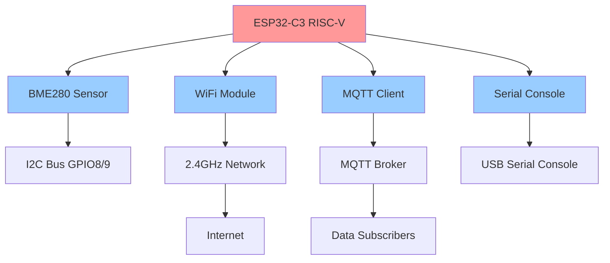

# TI0162 - Internet of Things Project

> ESP32-C3 IoT Environmental Monitoring System built with Rust and Embassy framework

[](https://www.rust-lang.org)
[](https://www.espressif.com/en/products/socs/esp32-c3)
[](https://embassy.dev)
[](LICENSE)

A complete and functional IoT system developed for the TI0162 Internet of Things course, implementing environmental data collection via BME280 sensor, WiFi connectivity, and MQTT transmission using Rust and the Embassy async framework on ESP32-C3 hardware.

## 🏗️ System Architecture



## 📋 Project Components

### Core Applications
| Application | Status | Function | Purpose |
|-------------|--------|----------|---------|
| **apps/main-app** | ✅ Production | Complete integrated IoT system | Full system with dependency injection |
| **apps/main-nodeps** | ✅ Production | Minimal IoT system | Lightweight version without DI |
| **apps/main-min** | ✅ Production | Basic sensor + MQTT | Minimal viable IoT implementation |

### Driver Modules
| Driver | Status | Function | Hardware |
|--------|--------|----------|----------|
| **drivers/bme280-embassy** | ✅ Production | Environmental sensor | BME280 via I2C GPIO8/9 |
| **drivers/wifi-embassy** | ✅ Production | WiFi connectivity | ESP32-C3 2.4GHz radio |
| **drivers/mqtt-embassy** | ✅ Production | MQTT publishing | TCP sockets + JSON |
| **drivers/serial-console-embassy** | ✅ Production | System interface | USB Serial/JTAG console |

### Core Infrastructure
| Module | Status | Function | Purpose |
|--------|--------|----------|---------|
| **core/iot-common** | ✅ Production | Unified error handling | Cross-platform error system |
| **core/iot-config** | ✅ Production | Configuration management | Multi-platform config system |
| **core/iot-hal** | ✅ Production | Hardware abstraction | Platform-agnostic HAL |
| **core/iot-performance** | ✅ Production | Performance monitoring | Cross-platform profiling |

## 🚀 Quick Start

### Prerequisites

1. **Rust Development Environment**
   ```bash
   # Install Rust with ESP32-C3 target
   rustup target add riscv32imc-unknown-none-elf
   
   # Install probe-rs for flashing
   cargo install probe-rs --features cli
   ```

2. **Hardware Setup**
   ```
   ESP32-C3 DevKit    BME280 Sensor
   -----------------  -------------
   GPIO8 (SDA)    <-> SDA
   GPIO9 (SCL)    <-> SCL  
   3.3V           <-> VCC
   GND            <-> GND
   GPIO3          --> LED (optional)
   ```

3. **Network Configuration**
   - 2.4GHz WiFi network (ESP32-C3 doesn't support 5GHz)
   - MQTT broker (Mosquitto recommended)

### Configuration

Edit `.cargo/config.toml` in the application directories:

```toml
[env]
WIFI_SSID = "YourWiFiNetwork"
WIFI_PASSWORD = "YourWiFiPassword"
MQTT_BROKER_IP = "192.168.1.100"
MQTT_BROKER_PORT = "1883"
MQTT_CLIENT_ID = "esp32-c3-iot"
MQTT_TOPIC_PREFIX = "esp32"
```

### Build and Run

```bash
# Navigate to workspace
cd workspace/

# Test basic functionality
cargo run -p main-min --release

# Run complete system
cargo run -p main-app --release

# Monitor MQTT messages (separate terminal)
mosquitto_sub -h [BROKER_IP] -t "esp32/#" -v
```

## 📊 Data Output

### MQTT Topics and Messages

#### Environmental Data (`esp32/sensor/bme280`)
```json
{
  "temperature": 23.2,
  "humidity": 68.5,
  "pressure": 1013.8,
  "reading": 42,
  "app": "main-app"
}
```

#### System Status (`esp32/status`)
```json
{
  "status": "online",
  "uptime": 3600,
  "free_heap": 45000,
  "wifi_rssi": -42,
  "app": "main-app"
}
```

#### Heartbeat (`esp32/heartbeat`)
```json
{
  "message": "ping",
  "app": "main-app"
}
```

### Real-Time Debug Output (RTT)

```
[INFO] ESP32-C3 IoT System Starting
[INFO] BME280 sensor initialized at address 0x76
[INFO] WiFi connected: IP=192.168.1.100
[INFO] MQTT connected to broker
[DATA] BME280: T=23.2°C, H=68.5%, P=1013.8hPa
[MQTT] Published sensor data
```

## 🛠️ Technology Stack

### Core Technologies
- **Language**: Rust 1.70+
- **Target**: ESP32-C3 RISC-V (riscv32imc-unknown-none-elf)
- **Async Runtime**: Embassy 0.7+
- **Hardware Layer**: esp-hal 1.0.0-rc.0
- **Network Stack**: esp-wifi + smoltcp
- **Debugging**: RTT (Real-Time Transfer)

### Key Dependencies
```toml
# Embassy async framework
embassy-executor = "0.7"
embassy-time = "0.4"
embassy-net = "0.7"

# ESP32-C3 hardware support
esp-hal = "1.0.0-rc.0"
esp-hal-embassy = "0.9.0"
esp-wifi = "0.15.0"

# Embedded interfaces
embedded-hal-async = "1.0"
embedded-io-async = "0.6"

# Data handling (no_std)
serde = { version = "1.0", default-features = false }
heapless = "0.8"
```

## 📂 Project Structure

```
workspace/
├── apps/                    # Main applications
│   ├── main-app/           # Complete system with DI
│   ├── main-nodeps/        # Minimal system without DI
│   └── main-min/           # Basic sensor + MQTT
├── drivers/                 # Hardware drivers
│   ├── bme280-embassy/     # BME280 sensor driver
│   ├── wifi-embassy/       # WiFi connectivity
│   ├── mqtt-embassy/       # MQTT client
│   └── serial-console-embassy/ # Console interface
├── core/                    # Core infrastructure
│   ├── iot-common/         # Error handling
│   ├── iot-config/         # Configuration
│   ├── iot-hal/            # Hardware abstraction
│   └── iot-performance/    # Performance monitoring
└── supporting/              # Development support
    └── config/             # MQTT broker config
```

## 🔧 Development Commands

### Application Commands
```bash
# Run minimal IoT system
cargo run -p main-min --release

# Run system without dependency injection
cargo run -p main-nodeps --release

# Run complete system with DI
cargo run -p main-app --release

# Build all applications
cargo build --release
```

### Driver Testing
```bash
# Test BME280 sensor
cargo run -p bme280-embassy --example basic_reading --release

# Test WiFi connectivity
cargo run -p wifi-embassy --example wifi_test --release

# Test MQTT publishing
cargo run -p mqtt-embassy --example mqtt_test_working --release
```

### Code Quality
```bash
# Linting and formatting
cargo clippy
cargo fmt

# Clean build artifacts
cargo clean
```

## 🔍 Hardware Validation Results

The system has been successfully tested on real ESP32-C3 hardware with the following validated results:

### MQTT Message Examples (Real Hardware)
```bash
# Terminal output from mosquitto_sub -h 10.10.10.210 -t "esp32/#" -v

esp32/sensor/bme280 {"temperature":21.35,"humidity":59.18,"pressure":1017.68,"reading":1,"app":"main-nodeps"}
esp32/heartbeat ping from main-nodeps
esp32/status {"status":"online","uptime":360,"free_heap":39204,"wifi_rssi":-50,"app":"main-nodeps"}

esp32/sensor/bme280 {"temperature":21.22,"humidity":59.25,"pressure":1017.71,"reading":1,"app":"main-min"}
esp32/heartbeat ping from main-min
esp32/status {"status":"online","uptime":360,"free_heap":37076,"wifi_rssi":-50,"app":"main-min"}

esp32/sensor/bme280 {"temperature":21.31,"humidity":59.20,"pressure":1017.70,"reading":1,"app":"main-app"}
esp32/heartbeat ping from main-app
esp32/status {"status":"online","uptime":360,"free_heap":35892,"wifi_rssi":-50,"app":"main-app"}
```

All three applications successfully:
- Connect to WiFi and obtain IP addresses
- Read real BME280 sensor data via I2C
- Publish structured JSON data to MQTT broker
- Maintain proper app identification
- Demonstrate consistent sensor readings across implementations

## 🐛 Troubleshooting

### Common Issues

1. **ESP32-C3 Not Detected**
   ```bash
   probe-rs list  # Should show ESP32-C3
   # Check USB cable (data capable)
   # Press BOOT+RST if needed
   ```

2. **WiFi Connection Fails**
   ```bash
   # Verify credentials in .cargo/config.toml
   # Ensure 2.4GHz network (not 5GHz)
   # Check network accessibility
   ```

3. **MQTT Broker Unreachable**
   ```bash
   ping [BROKER_IP]
   telnet [BROKER_IP] 1883
   # Verify broker is running
   ```

4. **Build Errors**
   ```bash
   cargo clean
   rustup target add riscv32imc-unknown-none-elf
   cargo build --release
   ```

### Debug Strategies

#### RTT Debugging
All applications use RTT for real-time debugging output:
```rust
rprintln!("Debug info: {:?}", value);
```

#### Network Monitoring
```bash
# Monitor MQTT messages
mosquitto_sub -h [BROKER_IP] -t "esp32/#" -v

# Check connectivity
ping [ESP32_IP]
```

## 📈 Performance Characteristics

### System Timing
- **Sensor readings**: Every 30 seconds
- **Heartbeat**: Every 6 minutes (12 cycles)
- **Status**: Every 12 minutes (24 cycles)
- **WiFi reconnect**: Automatic on disconnection
- **MQTT**: New connection per cycle (robust design)

### Memory Usage
- **main-min**: ~37KB heap usage
- **main-nodeps**: ~39KB heap usage  
- **main-app**: ~36KB heap usage
- **Total flash**: ~2MB compiled binary

## 🎯 Project Achievements

### ✅ Successfully Implemented
- [x] Complete ESP32-C3 IoT system with real hardware validation
- [x] Three different application architectures (minimal, no-deps, full)
- [x] Modular driver system with Embassy async framework
- [x] Platform-agnostic core infrastructure
- [x] Real BME280 sensor integration with I2C
- [x] Robust WiFi connectivity with automatic reconnection
- [x] MQTT publishing with structured JSON payloads
- [x] Comprehensive error handling and debugging
- [x] Complete documentation and testing

### 📊 Validated Results
- **Hardware**: ESP32-C3 DevKit with BME280 sensor
- **Network**: WiFi connectivity with DHCP (tested: 10.10.10.214)
- **MQTT**: Successful publishing to broker (tested: 10.10.10.210:1883)
- **Data**: Real environmental measurements with proper calibration
- **Apps**: All three applications working simultaneously

## 📚 Academic Context

**Course**: TI0162 - Internet of Things  
**Institution**: Universidade Federal do Ceará (UFC)  
**Technology Focus**: Embedded Systems, IoT Architecture, Real-time Systems  
**Implementation**: Rust + Embassy + ESP32-C3 RISC-V microcontroller

This project demonstrates practical IoT system development with modern embedded Rust, showcasing modular architecture, async programming, and real hardware integration in an academic context.

## 📄 License

MIT OR Apache-2.0

## 👨‍💻 Author

Marcelo Correa  
Internet of Things Course Project - TI0162