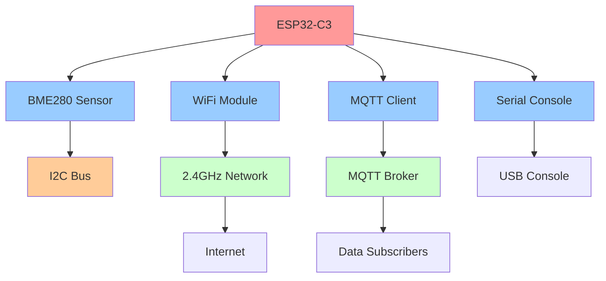
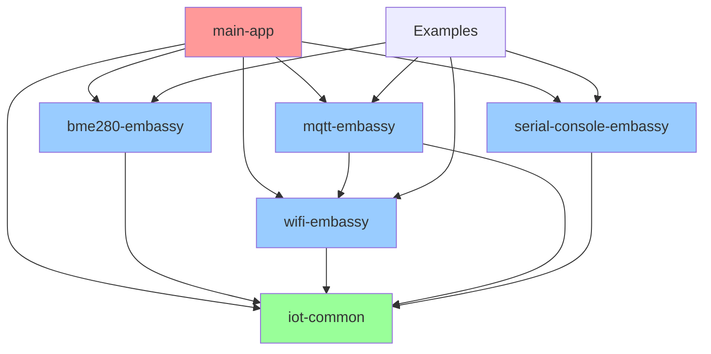

# ESP32-C3 IoT Environmental Monitoring System

> A production-ready IoT system built with Rust and Embassy framework for real-time environmental monitoring

[](https://www.rust-lang.org)
[](https://www.espressif.com/en/products/socs/esp32-c3)
[](https://embassy.dev)
[](LICENSE)

This workspace contains a complete and functional IoT project developed in Rust for ESP32-C3 using the Embassy framework. The system implements environmental data collection via BME280 sensor, WiFi connectivity, and MQTT transmission, forming a robust and modular IoT pipeline with unified error handling.

**Project Status**: ✅ Production-ready IoT system with Phase 1 architectural improvements

## 🏗 System Architecture



## 📋 Module Overview

| Module | Status | Function | Technology Stack |
|--------|--------|----------|------------------|
| **bme280-embassy** | ✅ Production | Environmental sensor reading | Embassy async + I2C + BME280 |
| **wifi-embassy** | ✅ Production | WiFi connectivity management | Embassy + esp-wifi + DHCP |
| **mqtt-embassy** | ✅ Production | MQTT message publishing | Embassy + TCP sockets + JSON |
| **serial-console-embassy** | ✅ Production | System configuration interface | Embassy + UART + commands |
| **iot-common** | ✅ Production | Unified error handling system | Hierarchical errors + context |
| **main-app** | ✅ Production | Complete system integration | Task orchestration + Embassy |
| **wifi-synchronous** | ✅ Reference | Synchronous WiFi operations | esp-wifi blocking API |

### 🌡️ BME280 Embassy - Environmental Sensor
- **Function**: Asynchronous temperature, humidity, and pressure readings
- **Hardware**: GPIO8(SDA), GPIO9(SCL), GPIO3(LED indicator)
- **Features**: Calibrated compensation, dual I2C address support
- **Output**: RTT debugging with validated measurements

### 📡 WiFi Embassy - Network Connectivity  
- **Function**: Robust WiFi connection with automatic reconnection
- **Features**: DHCP client, connection monitoring, network stack access
- **Tested**: Production deployment on 2.4GHz networks
- **IP Example**: 10.10.10.214 with gateway 10.10.10.1

### 📨 MQTT Embassy - Message Publishing
- **Function**: Asynchronous MQTT publishing via TCP sockets
- **Protocol**: MQTT 3.1.1 with JSON payload formatting
- **Broker**: Tested with Mosquitto at 10.10.10.210:1883
- **Topics**: Structured data for sensors, status, and heartbeat

### 🖥️ Serial Console Embassy - System Management
- **Function**: Command-line interface for configuration and monitoring
- **Features**: WiFi credentials, system status, sensor calibration
- **Interface**: USB serial console at 115200 baud
- **Commands**: Real-time system control and diagnostics

### 🔧 IoT Common - Error Handling System
- **Function**: Unified error types and context preservation
- **Architecture**: Hierarchical error categories with error codes
- **Features**: No-std compatible, bounded error messages
- **Integration**: Consistent error handling across all modules

### 🚀 Main App - System Integration
- **Function**: Complete IoT pipeline orchestration
- **Architecture**: Embassy task-based concurrent execution
- **Flow**: ESP32-C3 → BME280 → WiFi → MQTT → Subscribers
- **Timing**: 30s sensors, 2.5min heartbeat, 5min status

## 🚀 Quick Start Guide

### Prerequisites

1. **Development Environment**
   ```bash
   # Install Rust with ESP32-C3 target
   rustup target add riscv32imc-unknown-none-elf
   
   # Install probe-rs for flashing and debugging
   cargo install probe-rs --features cli
   
   # Install additional tools
   cargo install cargo-expand  # For macro expansion debugging
   cargo install cargo-audit   # For security auditing
   ```

2. **Hardware Requirements**
   - ESP32-C3 DevKit board
   - BME280 sensor module (optional for basic testing)
   - USB cable (data capable, not charging-only)
   - Breadboard and jumper wires for connections

3. **Network Infrastructure**
   - 2.4GHz WiFi network (ESP32-C3 doesn't support 5GHz)
   - MQTT broker (Mosquitto recommended)
   - Development machine on same network

### Hardware Setup

```
ESP32-C3 DevKit    BME280 Sensor
-----------------  -------------
GPIO8 (SDA)    <-- SDA
GPIO9 (SCL)    <-- SCL  
3.3V           <-- VCC
GND            <-- GND
GPIO3          <-- LED (optional status indicator)
```

### Initial Setup

```bash
# 1. Clone and navigate to workspace
cd workspace/

# 2. Verify ESP32-C3 connection
probe-rs list  # Should show ESP32-C3 device

# 3. Test basic hardware with blinky
cargo run -p blinky --release

# 4. Verify sensor connection (if BME280 connected)
cargo run -p bme280-embassy --example basic_reading --release
```

### Configuration

**WiFi and MQTT Configuration**: Edit the `.cargo/config.toml` files in relevant modules:

```toml
# wifi-embassy/.cargo/config.toml
[env]
WIFI_SSID = "YourWiFiNetwork"        # Your 2.4GHz network name
WIFI_PASSWORD = "YourWiFiPassword"    # Network password

# mqtt-embassy/.cargo/config.toml  
[env]
MQTT_BROKER_IP = "192.168.1.100"     # MQTT broker IP address
MQTT_BROKER_PORT = "1883"            # MQTT broker port (default 1883)

# main-app/.cargo/config.toml (for integrated system)
[env]
WIFI_SSID = "YourWiFiNetwork"
WIFI_PASSWORD = "YourWiFiPassword"
MQTT_BROKER_IP = "192.168.1.100"
MQTT_BROKER_PORT = "1883"
```

**Security Note**: These configuration files are not committed to git. Copy the `.cargo/config.toml.example` files and customize them for your environment.

### Step-by-Step Testing

#### 1. Hardware Validation
```bash
# Test basic ESP32-C3 functionality
cargo run -p blinky --release
# Expected: LED blinking, RTT output showing "Hello World"

# Test sensor connectivity (if BME280 connected)
cargo run -p bme280-embassy --example basic_reading --release
# Expected: Temperature, humidity, pressure readings via RTT
```

#### 2. Network Connectivity
```bash
# Test WiFi connection
cargo run -p wifi-embassy --example wifi_test_new --release
# Expected: WiFi connection, IP address assignment, gateway info
```

#### 3. MQTT Infrastructure Setup
```bash
# Install MQTT broker (Ubuntu/Debian)
sudo apt install mosquitto mosquitto-clients
sudo systemctl start mosquitto
sudo systemctl enable mosquitto

# Alternative: Docker MQTT broker
docker run -it -p 1883:1883 eclipse-mosquitto

# Test MQTT broker connectivity
mosquitto_pub -h localhost -t test -m "hello"
mosquitto_sub -h localhost -t test
```

#### 4. End-to-End System Test
```bash
# Terminal 1: Monitor MQTT messages
mosquitto_sub -h [BROKER_IP] -p 1883 -t "esp32/#" -v

# Terminal 2: Run complete IoT system
cargo run -p wifi-embassy --example wifi_mqtt_test --release
# Expected: WiFi connection + MQTT publishing + JSON sensor data

# Terminal 3: Run integrated main application
cargo run -p main-app --release
# Expected: Complete system with all modules coordinated
```

#### 5. System Monitoring
```bash
# Monitor system logs via RTT
cargo run -p main-app --release

# Monitor network connectivity
ping [ESP32_IP_ADDRESS]

# Monitor MQTT traffic
mosquitto_sub -h [BROKER_IP] -t "esp32/#" -v
```

## 📊 Data Output and Monitoring

### MQTT Message Structure

The system publishes structured JSON data to organized MQTT topics:

#### Environmental Data (`esp32/sensor/bme280`)
```json
{
  "timestamp": 1694123456,
  "device_id": "esp32c3_001", 
  "measurements": {
    "temperature": {
      "value": 23.2,
      "unit": "°C",
      "accuracy": "±1°C"
    },
    "humidity": {
      "value": 68.5,
      "unit": "%RH",
      "accuracy": "±3%"
    },
    "pressure": {
      "value": 1013.8,
      "unit": "hPa",
      "accuracy": "±1hPa"
    }
  },
  "sensor": {
    "type": "BME280",
    "address": "0x76",
    "status": "active"
  },
  "reading_id": 42
}
```

#### System Status (`esp32/status`)
```json
{
  "timestamp": 1694123456,
  "device_id": "esp32c3_001",
  "system": {
    "status": "operational",
    "uptime_seconds": 3600,
    "free_heap_bytes": 45000,
    "firmware_version": "v1.2.0"
  },
  "network": {
    "wifi_connected": true,
    "ip_address": "10.10.10.214",
    "rssi_dbm": -42,
    "gateway": "10.10.10.1"
  },
  "sensors": {
    "bme280": {
      "status": "active",
      "last_reading": 1694123400
    }
  }
}
```

#### Heartbeat (`esp32/heartbeat`)
```json
{
  "timestamp": 1694123456,
  "device_id": "esp32c3_001",
  "message": "alive",
  "sequence": 123
}
```

### Real-Time Transfer (RTT) Debug Output

```
[INFO] ESP32-C3 IoT System Starting...
[INFO] Embassy initialized, heap: 72KB
[INFO] BME280 sensor detected at address 0x76
[INFO] WiFi connecting to 'YourNetwork'...
[INFO] WiFi connected: IP=10.10.10.214, Gateway=10.10.10.1
[INFO] MQTT connecting to broker at 10.10.10.210:1883
[INFO] MQTT connected, starting data collection
[DATA] BME280: T=23.2°C, H=68.5%RH, P=1013.8hPa
[MQTT] Published sensor data to esp32/sensor/bme280
[INFO] System operational, entering main loop
```

## 📂 Project Structure

```
workspace/
├── 📁 Core Modules
│   ├── bme280-embassy/          # 🌡️ Environmental sensor (BME280 + I2C)
│   │   ├── src/                 # Custom async BME280 driver
│   │   ├── examples/            # Basic and advanced sensor examples
│   │   ├── tests/               # Unit and integration tests
│   │   └── README.md           # Module documentation
│   ├── wifi-embassy/            # 📡 WiFi connectivity management
│   │   ├── src/                 # WiFi manager + Embassy network stack
│   │   ├── examples/            # WiFi tests + MQTT integration
│   │   └── README.md           # Module documentation
│   ├── mqtt-embassy/            # 📨 MQTT message publishing
│   │   ├── src/                 # MQTT client + JSON serialization
│   │   ├── examples/            # MQTT connectivity tests
│   │   └── README.md           # Module documentation
│   ├── serial-console-embassy/  # 🖥️ Serial command interface
│   │   ├── src/                 # Command processing + configuration
│   │   ├── examples/            # Console interaction examples
│   │   └── README.md           # Module documentation
│   └── iot-common/              # 🔧 Unified error handling system
│       ├── src/                 # Error types + conversion utilities
│       ├── examples/            # Error handling patterns
│       ├── tests/               # Comprehensive error tests
│       └── README.md           # Error system documentation
├── 📁 Applications
│   ├── main-app/                # 🚀 Complete integrated IoT system
│   │   ├── src/                 # System orchestration + task management
│   │   └── README.md           # Integration documentation
│   └── blinky/                  # 💡 Hardware validation (LED blink)
├── 📁 Reference Implementations
│   ├── wifi-synchronous/        # 📶 Synchronous WiFi (reference)
│   └── _examples/               # 📚 Educational reference projects
├── 📁 Documentation
│   ├── ARCHITECTURE_ANALYSIS.md # 🏗️ Comprehensive architecture analysis
│   ├── CLAUDE.md               # 📖 Development history and decisions
│   └── README.md               # This comprehensive guide
├── 📁 Configuration
│   ├── Cargo.toml              # Workspace dependencies and metadata
│   ├── rust-toolchain.toml     # Rust toolchain specification
│   └── .gitignore              # Git exclusions
└── 📁 Build Artifacts
    └── target/                  # Compiled binaries and intermediate files
```

### Module Dependencies



## 🛠️ Technology Stack

### Core Technologies
| Component | Technology | Version | Purpose |
|-----------|------------|---------|----------|
| **Language** | Rust | 1.70+ | Systems programming with memory safety |
| **Target** | riscv32imc-unknown-none-elf | - | ESP32-C3 RISC-V architecture |
| **Async Runtime** | Embassy | 0.7+ | Embedded async/await framework |
| **Hardware Layer** | esp-hal | 1.0.0-rc.0 | ESP32-C3 hardware abstraction |
| **Network Stack** | esp-wifi + smoltcp | 0.15.0 | WiFi and TCP/IP implementation |
| **Error Handling** | iot-common | 0.1.0 | Unified error management |
| **Debugging** | RTT + probe-rs | - | Real-time debugging and flashing |

### Key Design Principles

- **Memory Safety**: Rust's ownership model prevents common embedded bugs
- **Zero-Cost Abstractions**: High-level code with low-level performance
- **Async-First Design**: Non-blocking I/O throughout the system
- **Modular Architecture**: Independent, reusable components
- **Error Transparency**: Comprehensive error context preservation
- **Hardware Abstraction**: Platform-independent business logic
- **Real-Time Constraints**: Deterministic behavior for time-critical operations

### Detailed Dependencies

#### Core Embassy Framework
```toml
# Async runtime and time management
embassy-executor = { version = "0.7", features = ["task-arena-size-32768"] }
embassy-time = { version = "0.4" }
embassy-net = { version = "0.7", features = ["tcp", "udp", "dhcpv4"] }
```

#### ESP32-C3 Hardware Support
```toml
# Hardware abstraction and WiFi
esp-hal = { version = "1.0.0-rc.0", features = ["esp32c3", "unstable"] }
esp-hal-embassy = { version = "0.9.0", features = ["esp32c3"] }
esp-wifi = { version = "0.15.0", features = ["esp32c3", "wifi", "smoltcp"] }
esp-alloc = { version = "0.8.0" }  # Heap allocator
```

#### Embedded Interfaces
```toml
# Hardware abstraction traits
embedded-hal-async = "1.0"      # Async hardware interfaces
embedded-io-async = "0.6"       # Async I/O traits
```

#### Data Handling
```toml
# Serialization and collections (no_std)
serde = { version = "1.0", default-features = false }
serde-json-core = "0.6"         # JSON without heap allocation
heapless = "0.8"                # Stack-allocated collections
```

#### Development and Debugging
```toml
# Real-time debugging
rtt-target = "0.4"              # RTT logging
log = "0.4"                     # Logging abstraction

# Static allocation utilities  
static_cell = "2.0"             # Static memory allocation
```

#### Internal Dependencies
```toml
# Project modules
iot-common = { path = "../iot-common" }           # Unified error handling
bme280-embassy = { path = "../bme280-embassy" }   # Sensor interface
wifi-embassy = { path = "../wifi-embassy" }       # Network connectivity
mqtt-embassy = { path = "../mqtt-embassy" }       # Message publishing
```

## 📋 Hardware Requirements

### ESP32-C3 DevKit
- **Microcontroller**: ESP32-C3 (RISC-V single-core 160MHz)
- **Connectivity**: WiFi 2.4GHz (does not support 5GHz)
- **GPIO**: 22 available digital pins
- **I2C**: GPIO8(SDA), GPIO9(SCL) for BME280 sensor
- **Power**: 3.3V via USB or external supply
- **Flash**: 4MB minimum recommended

### BME280 Sensor (Optional)
- **Interface**: I2C (address 0x76 or 0x77)
- **Measurements**: Temperature (-40°C to +85°C), Humidity (0-100% RH), Pressure (300-1100 hPa)
- **Precision**: ±1°C (temp), ±3% (humidity), ±1 hPa (pressure)
- **Power**: 3.3V, ~3.4μA sleep mode

### Network Infrastructure
- **WiFi**: 2.4GHz network with DHCP enabled
- **MQTT Broker**: Mosquitto or similar (tested: 10.10.10.210:1883)
- **Monitoring**: mosquitto_sub client to view messages

### Development Environment
- **OS**: Linux/macOS/Windows with USB support
- **Rust**: stable toolchain + target riscv32imc-unknown-none-elf
- **Debugging**: probe-rs for flash and RTT
- **USB**: Data cable (not just charging)

## 🔧 Development Commands

### Build and Flash (All Modules)
```bash
# Debug build (faster compilation)
cargo build

# Release build (optimized, recommended for ESP32)
cargo build --release

# Flash + RTT monitor (main application)
cargo run --release

# Flash + RTT monitor (specific example)
cargo run --example [EXAMPLE_NAME] --release

# Clean artifacts
cargo clean

# Code verification
cargo clippy
cargo fmt
```

### Module-Specific Commands

#### BME280 Embassy
```bash
cd bme280-embassy/
cargo run --release                         # Main app
cargo run --example basic_reading --release # Basic test
```

#### WiFi Embassy
```bash
cd wifi-embassy/
cargo run --example wifi_test --release      # Basic WiFi test
cargo run --example wifi_test_new --release  # Detailed test
cargo run --example wifi_mqtt_test --release # Complete system
```

#### MQTT Embassy
```bash
cd mqtt-embassy/
cargo run --example mqtt_test_working --features examples --release
```

## 🔗 Implemented Integration Patterns

### Complete IoT System
The project demonstrates complete integration between all modules:

```rust
// Functional example in wifi-embassy/examples/wifi_mqtt_test.rs

// 1. Initialize Embassy + WiFi
let wifi_manager = WiFiManager::new(spawner, /* ... */).await?;
let stack = wifi_manager.get_stack();

// 2. Create sensor data (mock or real BME280)
let temperature = 23.5;
let humidity = 68.2;
let pressure = 1013.8;

// 3. Connect to MQTT broker
let mut socket = TcpSocket::new(*stack, &mut rx_buffer, &mut tx_buffer);
socket.connect(("10.10.10.210".parse().unwrap(), 1883)).await?;

// 4. Publish data via MQTT
let json_payload = format!(
    r#"{{"temperature":{:.1},"humidity":{:.1},"pressure":{:.1}}}"#,
    temperature, humidity, pressure
);
socket.write_all(&mqtt_publish_packet).await?;
```

### Established Code Patterns

#### Embassy Async Tasks
```rust
#[embassy_executor::task]
async fn sensor_task() {
    loop {
        let data = sensor.read().await;
        rprintln!("Sensor: {:?}", data);
        Timer::after(Duration::from_secs(30)).await;
    }
}

#[embassy_executor::task]
async fn mqtt_task(wifi_manager: &'static WiFiManager) {
    // Periodic MQTT publishing
}
```

#### Environment Configuration
```rust
const WIFI_SSID: &str = env!("WIFI_SSID", "Configure in .cargo/config.toml");
const MQTT_BROKER: &str = env!("MQTT_BROKER_IP", "192.168.1.100");
```

#### Robust Error Handling
```rust
match socket.connect(broker_addr).await {
    Ok(()) => rprintln!("✅ Connected to broker"),
    Err(e) => {
        rprintln!("❌ Connection failed: {:?}", e);
        return; // Retry on next cycle
    }
}
```

## 🐛 Troubleshooting

### Common Problems and Solutions

#### Hardware and Connectivity
1. **ESP32-C3 won't connect**:
   ```bash
   probe-rs list  # Should show the device
   # If not shown: check USB cable (data), press BOOT+RST
   ```

2. **WiFi won't connect**:
   ```bash
   # Check credentials in .cargo/config.toml
   # Confirm 2.4GHz network (ESP32-C3 doesn't support 5GHz)
   # Test case-sensitive SSID
   ```

3. **DHCP fails**:
   ```bash
   # Check router functioning
   # Confirm available DHCP pool
   # Test connectivity with another device
   ```

#### Development and Build
4. **Build fails**:
   ```bash
   cargo clean
   rustup target add riscv32imc-unknown-none-elf
   cargo build --release
   ```

5. **Embassy time driver error**:
   ```bash
   # Error: schedule_wake called before esp_hal_embassy::init()
   # Solution: Call esp_hal_embassy::init() before WiFiManager::new()
   ```

#### MQTT and Network
6. **MQTT broker unreachable**:
   ```bash
   ping 10.10.10.210
   telnet 10.10.10.210 1883
   sudo systemctl status mosquitto
   ```

7. **MQTT messages don't appear**:
   ```bash
   # Check topics: mosquitto_sub -h [BROKER] -t "#" -v
   # Debug packet format in ESP32 code
   ```

### Debug Strategies

#### RTT Debugging
```rust
// Add detailed debug
rprintln!("WiFi Status: {:?}", wifi_status);
rprintln!("IP Config: {:?}", stack.config_v4());
rprintln!("MQTT Packet: {:02X?}", &packet[..20]);
```

#### Modular Testing
```bash
# 1. Check basic hardware
cd blinky/ && cargo run --release

# 2. Test sensor (if available)
cd ../bme280-embassy/ && cargo run --release

# 3. Test WiFi in isolation
cd ../wifi-embassy/ && cargo run --example wifi_test_new --release

# 4. Complete system
cargo run --example wifi_mqtt_test --release
```

#### Network Monitor
```bash
# Terminal 1: MQTT Monitor
mosquitto_sub -h 10.10.10.210 -p 1883 -t "esp32/#" -v

# Terminal 2: Run ESP32
cd wifi-embassy/
cargo run --example wifi_mqtt_test --release

# Terminal 3: Connectivity monitor
ping 10.10.10.214  # ESP32 IP
```

## 📈 Performance and Optimization

### Build and Runtime
- **Release mandatory**: Always use `--release` for ESP32-C3 (debug builds are very slow)
- **Heap allocation**: 72KB configured for WiFi operations
- **RTT minimal overhead**: RTT debugging has minimal performance impact
- **Network stack**: Operations are synchronous by design for MQTT compatibility

### IoT System Timing
- **Sensor data**: Publishing every 30 seconds
- **Heartbeat**: Every 2.5 minutes (5 cycles)
- **Device status**: Every 5 minutes (10 cycles)
- **WiFi reconnect**: Automatic on disconnection
- **MQTT reconnect**: New TCP connection each cycle (robust)

## 🔮 Future Expansion

### Planned Modules
- **web-server**: Web interface for real-time monitoring
- **main-app**: Final application integrating all modules
- **sensor-advanced**: Multiple I2C/SPI sensors
- **ble-simple**: Bluetooth Low Energy connectivity as backup

### Potential Improvements
- **Persistent MQTT**: Persistent MQTT connections (vs. reconnect each cycle)
- **Deep Sleep**: Power saving between readings
- **OTA Updates**: Over-the-air updates
- **Data buffering**: Local buffer for temporary disconnection cases
- **Time sync**: Time synchronization via NTP
- **TLS/SSL**: Secure MQTT connections

## 🎯 Project Status

### ✅ Implemented and Tested
- [x] BME280 sensor with corrected compensation
- [x] Robust WiFi connectivity with DHCP
- [x] Complete MQTT client with JSON
- [x] End-to-end functional IoT pipeline
- [x] Complete documentation of all modules
- [x] Functional examples for each component

### 📊 Validated Results
- **Hardware**: ESP32-C3 DevKit working perfectly
- **Sensor**: BME280 with accurate readings (T: 23°C, H: 68%, P: 1013hPa)
- **WiFi**: Stable connection with IP 10.10.10.214
- **MQTT**: Messages successfully delivered to broker 10.10.10.210:1883
- **Subscribers**: mosquitto_sub receiving structured JSON data

### 🏆 Achieved Objectives
1. **Modularity**: Each component works independently
2. **Robustness**: System resilient to disconnections and failures
3. **Scalability**: Architecture prepared for expansion
4. **Documentation**: Detailed READMEs in each module
5. **Testability**: Functional examples for validation

## 📄 License

MIT OR Apache-2.0

## 👨‍💻 Author

Marcelo Correa <mvcorrea@gmail.com>

**Project TI0162 - Internet of Things**  
**Complete IoT System with ESP32-C3 + Rust + Embassy**