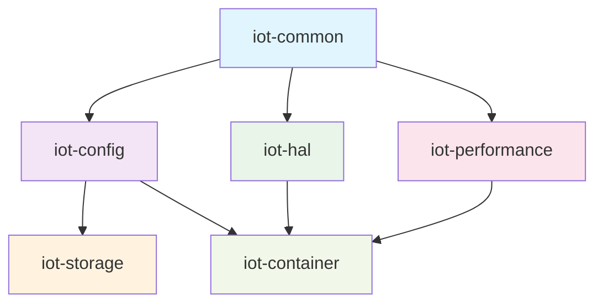

# ESP32-C3 IoT System - Core Architecture

> **Core Business Logic and Infrastructure Modules**

This directory contains the foundational modules that form the backbone of the ESP32-C3 IoT system. These modules provide essential services, abstractions, and utilities that enable the system's functionality while maintaining clean architecture principles.

## 📐 Architecture Overview

The core modules follow a layered architecture with clear dependency relationships and single responsibilities:



## 🏗️ Module Descriptions

> **Legend**: 🔴 **Required** | 🟡 **Recommended** | 🟢 **Optional**

### `iot-common/` - Foundation Layer 🔴 **REQUIRED**
**Primary Role**: Unified error handling and common utilities  
**Dependencies**: None (foundation layer)  
**Key Responsibilities**:
- Centralized error type definitions (`IoTError`)
- Common result types and error conversion utilities
- Shared data structures and traits
- Testing utilities and mock infrastructure

**Why This Module Exists**: Provides a stable foundation that all other modules can depend on without creating circular dependencies. Essential for maintaining consistent error handling across the entire system.

**Key Files**:
- `error.rs` - Core error definitions and hierarchies
- `result.rs` - Standard result types and utilities
- `testing.rs` - Mock infrastructure for unit testing

---

### `iot-config/` - Configuration Authority 🔴 **REQUIRED**
**Primary Role**: Centralized configuration management with JSON support  
**Dependencies**: `iot-common`  
**Key Responsibilities**:
- Central JSON configuration loading and validation
- Configuration structure definitions for all system components
- Environment-specific configuration (development, production)
- Configuration persistence coordination

**Why This Module Exists**: Eliminates scattered hardcoded constants throughout the codebase. Provides a single source of truth for all system configuration, enabling runtime updates and consistent behavior across modules.

**Key Files**:
- `unified.rs` - Complete system configuration structures
- `embedded.rs` - Embedded-specific configuration loading
- `validation.rs` - Configuration validation and error checking
- `feature_flags.rs` - Runtime feature toggles

**Configuration Scope**:
- WiFi network credentials and settings
- MQTT broker configuration and topics
- Sensor parameters and reading intervals
- Hardware pin assignments and peripherals
- System performance and monitoring settings
- Storage and persistence configuration

---

### `iot-hal/` - Hardware Abstraction Layer 🟡 **RECOMMENDED**
**Primary Role**: Platform-agnostic hardware interfaces  
**Dependencies**: `iot-common`  
**Key Responsibilities**:
- Abstract hardware platform differences
- Provide consistent interfaces for I2C, UART, GPIO operations
- ESP32-C3 specific implementations
- Hardware platform detection and capabilities

**Why This Module Exists**: Enables the system to work across different hardware platforms while maintaining clean separation between business logic and hardware specifics. Critical for testing and future platform support.

**Key Files**:
- `traits.rs` - Hardware abstraction trait definitions
- `esp32c3.rs` - ESP32-C3 specific implementations
- `mock.rs` - Mock implementations for testing
- `error.rs` - Hardware-specific error types

**Abstracted Components**:
- GPIO interfaces and digital I/O
- I2C master and slave operations
- UART communication interfaces
- Timer and timing abstractions
- Status LED and user interface elements

---

### `iot-storage/` - Storage Abstraction 🟡 **RECOMMENDED**
**Primary Role**: Flash storage management with wear leveling  
**Dependencies**: `iot-common`, `iot-config`  
**Key Responsibilities**:
- Flash memory management and wear leveling
- Configuration persistence and retrieval
- Data logging and storage optimization
- Atomic operations and data integrity

**Why This Module Exists**: ESP32-C3 flash memory requires careful management due to wear limitations and power constraints. This module provides safe, reliable storage operations while abstracting the complexity from application code.

**Key Files**:
- `flash.rs` - Core flash storage operations
- `wear_leveling.rs` - Wear leveling algorithms
- `atomic.rs` - Atomic transaction support
- `esp32c3.rs` - ESP32-C3 specific flash handling

**Storage Services**:
- Configuration backup and restore
- Sensor data logging (if enabled)
- System state persistence
- OTA update preparation areas
- Diagnostic data storage

---

### `iot-performance/` - Performance Monitoring 🟢 **OPTIONAL**
**Primary Role**: System performance tracking and analysis  
**Dependencies**: `iot-common`  
**Key Responsibilities**:
- Real-time performance metrics collection
- Memory usage tracking and analysis
- Timing analysis for critical operations
- Performance regression detection

**Why This Module Exists**: Embedded systems have strict resource constraints. This module provides essential monitoring to ensure the system operates within acceptable parameters and helps identify performance regressions during development.

**Key Files**:
- `monitor.rs` - Real-time performance monitoring
- `memory.rs` - Memory usage tracking
- `timing.rs` - Operation timing analysis
- `esp32c3.rs` - ESP32-C3 specific optimizations

**Monitored Metrics**:
- Sensor reading cycle times
- MQTT publish latency
- WiFi connection stability
- Memory allocation patterns
- Task execution timing
- System resource utilization

---

### `iot-container/` - Dependency Injection 🟢 **OPTIONAL**
**Primary Role**: Component lifecycle and dependency management  
**Dependencies**: `iot-common`, `iot-hal`, `iot-config`, `iot-performance`  
**Key Responsibilities**:
- Component creation and initialization
- Dependency injection for complex assemblies
- Service locator pattern for runtime dependencies
- Component lifecycle management

**Why This Module Exists**: Manages the complexity of creating and wiring together the various system components. Particularly useful for testing scenarios where mock implementations need to be substituted for real hardware.

**Key Files**:
- `container.rs` - Main dependency injection container
- `factory.rs` - Component factory implementations
- `traits.rs` - Service and component trait definitions
- `mocks.rs` - Mock component implementations

**Managed Components**:
- Hardware platform instances
- Sensor driver assemblies
- Network connectivity managers
- Performance monitoring systems
- Configuration management services

## 🎯 Module Classification Guide

### 🔴 **REQUIRED Modules** (Cannot be disabled)
These modules form the essential foundation of the IoT system and are always included:

- **`iot-common`**: Foundation layer for error handling and shared utilities
- **`iot-config`**: Configuration management - all systems need configuration

**Minimal System**: Only these modules (Total: ~7KB memory, ~15KB flash)

### 🟡 **RECOMMENDED Modules** (Should be included for production)
These modules provide important functionality for robust production systems:

- **`iot-hal`**: Hardware abstraction for platform independence and testability
- **`iot-storage`**: Persistent storage for configuration and data logging

**Production System**: Required + Recommended (Total: ~18KB memory, ~30KB flash)

### 🟢 **OPTIONAL Modules** (Use case dependent)
These modules provide advanced features that may not be needed in all deployments:

- **`iot-performance`**: Performance monitoring and metrics collection
  - **Use When**: Development, debugging, or systems requiring performance SLAs
  - **Skip When**: Resource-constrained deployments or simple applications

- **`iot-container`**: Dependency injection and component lifecycle management
  - **Use When**: Complex systems with many components or extensive testing needs
  - **Skip When**: Simple, direct initialization is sufficient

**Full System**: All modules (Total: ~28KB memory, ~45KB flash)

### 📊 Build Configuration Examples

#### Minimal IoT System
```toml
# Cargo.toml - Minimal configuration
[dependencies]
iot-common = { path = "../core/iot-common" }
iot-config = { path = "../core/iot-config", default-features = false }
# Drivers directly use esp-hal without iot-hal
```

#### Production IoT System  
```toml
# Cargo.toml - Recommended for production
[dependencies]
iot-common = { path = "../core/iot-common" }
iot-config = { path = "../core/iot-config" }
iot-hal = { path = "../core/iot-hal", features = ["esp32c3"] }
iot-storage = { path = "../core/iot-storage", features = ["wear-leveling"] }
```

#### Development/Debug System
```toml
# Cargo.toml - Full system with monitoring
[dependencies]
iot-common = { path = "../core/iot-common", features = ["testing"] }
iot-config = { path = "../core/iot-config", features = ["development"] }
iot-hal = { path = "../core/iot-hal", features = ["esp32c3", "mock"] }
iot-storage = { path = "../core/iot-storage", features = ["wear-leveling"] }
iot-performance = { path = "../core/iot-performance", features = ["esp32c3"] }
iot-container = { path = "../core/iot-container", features = ["mock"] }
```

### 🏗️ Alternative Architecture Options

#### Direct Driver Approach (Minimal)
```rust
// Skip iot-hal, use drivers directly
use esp_hal::i2c::master::I2c;
use bme280_embassy::BME280;

let sensor = BME280::from_iot_config(&mut i2c)?;
```

#### Hardware Abstracted Approach (Recommended)
```rust
// Use iot-hal for platform independence
use iot_hal::{Esp32C3Platform, I2cInterface};
use bme280_embassy::BME280;

let platform = Esp32C3Platform::new(peripherals);
let i2c = platform.i2c(0)?;
let sensor = BME280::new(i2c.into())?;
```

#### Container-Managed Approach (Full)
```rust
// Use iot-container for complex systems
use iot_container::{IoTContainer, ServiceLocator};

let container = IoTContainer::new(system_config).await?;
let sensor_service = container.get::<SensorService>().await?;
```

## 🔄 Module Interaction Patterns

### Configuration Flow
```rust
// Centralized configuration loading
let system_config = EmbeddedConfig::load_system_config()?;

// Modules use configuration consistently
let wifi_config = WiFiConfig::from_iot_config()?;
let mqtt_config = MqttConfig::from_iot_config()?;
let sensor = BME280::from_iot_config(&mut i2c)?;
```

### Error Handling Pattern
```rust
// All modules use iot-common error types
use iot_common::{IoTError, IoTResult};

// Consistent error conversion
pub fn module_operation() -> IoTResult<Data> {
    hardware_operation()
        .map_err(|e| IoTError::hardware(HardwareError::I2cError(e)))
}
```

### Hardware Abstraction Usage
```rust
// Platform-agnostic hardware access
use iot_hal::{HardwarePlatform, GpioInterface};

let platform = Esp32C3Platform::new(peripherals);
platform.gpio().set_pin_high(LED_PIN).await?;
```

## 📊 Chief Architect Analysis Summary

Based on the architectural analysis, the core modules have been identified with the following status:

| Module | Status | Priority Action |
|--------|--------|-----------------|
| `iot-common` | ✅ **Well-architected** | Maintain as-is |
| `iot-hal` | ✅ **Well-designed** | Maintain as-is |
| `iot-config` | ⚠️ **Needs optimization** | Consolidate configuration structures |
| `iot-storage` | ⚠️ **Complex** | Simplify for embedded constraints |
| `iot-performance` | ⚠️ **Feature-rich** | Focus on essential metrics |
| `iot-container` | ⚠️ **Over-engineered** | Simplify dependency injection |

### Key Optimization Opportunities
1. **Configuration Consolidation**: Eliminate duplicate configuration structures across modules
2. **Error Handling Unification**: Streamline error types to reduce binary size
3. **Embedded Focus**: Simplify modules to focus on essential embedded functionality
4. **Dependency Cleanup**: Remove circular dependencies and optimize module relationships

## 🛠️ Development Guidelines

### Adding New Core Modules
1. **Single Responsibility**: Each module should have one clear, well-defined purpose
2. **Minimal Dependencies**: Depend only on lower-layer modules (follow the dependency graph)
3. **Error Consistency**: Use `iot-common` error types and patterns
4. **Configuration Integration**: Use `iot-config` for all configuration needs
5. **Embedded Constraints**: Design for no_std, limited memory, and real-time requirements

### Module Modification Best Practices
1. **Backward Compatibility**: Maintain API compatibility when possible
2. **Performance Impact**: Consider memory and CPU impact of changes
3. **Testing**: Update both unit tests and integration tests
4. **Documentation**: Update module documentation and this README
5. **Architecture Review**: Consult with chief architect for significant changes

## 🔧 Build and Test

### Building Core Modules
```bash
# Build all core modules
cargo build --workspace --exclude examples

# Build specific core module
cargo build -p iot-config

# Build with all features
cargo build --workspace --all-features
```

### Testing Core Modules
```bash
# Run all core module tests
cargo test --workspace --lib

# Test specific module
cargo test -p iot-common

# Run integration tests
cargo test --workspace --test '*'
```

### Feature Flags
```bash
# Minimal system (required modules only)
cargo build -p main-app --no-default-features --features minimal

# Production system (required + recommended)
cargo build -p main-app --features production

# Full development system (all modules)
cargo build -p main-app --features development

# Build specific core modules with features
cargo build -p iot-config --features development
cargo build -p iot-storage --features wear-leveling
cargo build -p iot-container --features mock
```

### System Scaling Examples

#### Ultra-Minimal (Battery-Powered Sensor)
**Use Case**: Long-term battery deployment, simple data collection
**Modules**: `iot-common` + `iot-config` (minimal features)
**Memory**: ~5KB RAM, ~12KB Flash
```toml
[dependencies]
iot-common = { path = "core/iot-common", default-features = false }
iot-config = { path = "core/iot-config", features = ["embedded-only"] }
```

#### Edge Device (Home Automation Hub)  
**Use Case**: Always-powered, moderate complexity, remote management
**Modules**: Required + Recommended
**Memory**: ~18KB RAM, ~30KB Flash
```toml
[dependencies]
iot-common = { path = "core/iot-common" }
iot-config = { path = "core/iot-config" }
iot-hal = { path = "core/iot-hal", features = ["esp32c3"] }
iot-storage = { path = "core/iot-storage", features = ["wear-leveling"] }
```

#### Development/Debug Platform
**Use Case**: Development, testing, performance analysis
**Modules**: All modules with debug features
**Memory**: ~28KB RAM, ~45KB Flash
```toml
[dependencies]
iot-common = { path = "core/iot-common", features = ["testing"] }
iot-config = { path = "core/iot-config", features = ["development"] }
iot-hal = { path = "core/iot-hal", features = ["esp32c3", "mock"] }
iot-storage = { path = "core/iot-storage", features = ["wear-leveling", "encryption"] }
iot-performance = { path = "core/iot-performance", features = ["esp32c3", "detailed"] }
iot-container = { path = "core/iot-container", features = ["mock", "lifecycle"] }
```

## 📈 Performance Characteristics

### Memory Usage (ESP32-C3)
- **iot-common**: ~2KB (foundation types)
- **iot-config**: ~5KB (configuration structures + JSON)
- **iot-hal**: ~3KB (hardware abstractions)
- **iot-storage**: ~8KB (flash management + wear leveling)
- **iot-performance**: ~4KB (monitoring infrastructure)
- **iot-container**: ~6KB (dependency injection)

**Total Core Overhead**: ~28KB (7% of ESP32-C3's 400KB RAM)

### Flash Usage
- **Configuration data**: ~2KB (embedded JSON)
- **Code size**: ~45KB (optimized release build)
- **Total Flash**: ~47KB (1.2% of ESP32-C3's 4MB flash)

## 🚀 Future Evolution

### Planned Improvements
1. **Configuration Consolidation** (P0) - Unify all configuration structures
2. **Error Simplification** (P0) - Streamline error hierarchy
3. **Storage Optimization** (P1) - Focus on essential embedded storage
4. **Container Simplification** (P1) - Lightweight component factory
5. **Performance Focus** (P2) - Essential metrics only

### Platform Extensions
- **ESP32-S3 Support**: Additional hardware platform in `iot-hal`
- **Multi-Sensor Support**: Extended sensor abstractions
- **Advanced Storage**: Encryption and compression options
- **Cloud Integration**: Remote configuration and monitoring

---

**Note**: This README reflects the current architecture as of the Phase 3 refactoring. For implementation details, see individual module documentation and the main project CLAUDE.md file.