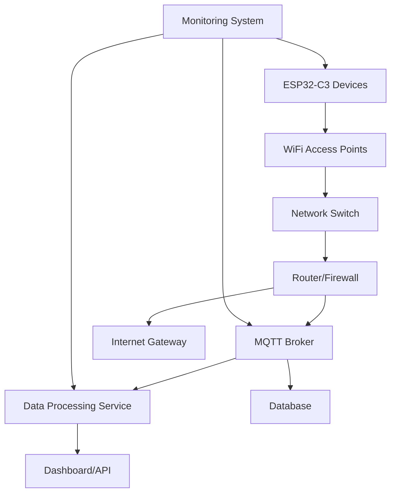

# Deployment Guide

> Production deployment strategies and configuration management for ESP32-C3 IoT Environmental Monitoring System

## Overview

This guide covers deploying the ESP32-C3 IoT system from development to production environments, including configuration management, security considerations, and operational procedures.

## Deployment Environments

### Development Environment
- **Purpose**: Local development and testing
- **Hardware**: Single ESP32-C3 with development tools
- **Network**: Development WiFi with MQTT broker on localhost
- **Monitoring**: RTT debugging via probe-rs
- **Configuration**: Local `.cargo/config.toml` files

### Staging Environment
- **Purpose**: Pre-production validation
- **Hardware**: Production-equivalent hardware setup
- **Network**: Isolated test network mimicking production
- **Monitoring**: Remote logging and monitoring systems
- **Configuration**: Environment-specific configuration files

### Production Environment
- **Purpose**: Live deployment with real sensors and data collection
- **Hardware**: Production ESP32-C3 devices with sensors
- **Network**: Secure production network infrastructure
- **Monitoring**: Comprehensive monitoring and alerting
- **Configuration**: Secure configuration management

## Hardware Deployment

### Production Hardware Requirements

#### ESP32-C3 Device Specifications
```
Microcontroller: ESP32-C3 (RISC-V 160MHz)
Memory: 384KB SRAM, 4MB Flash (minimum)
Connectivity: WiFi 2.4GHz (802.11 b/g/n)
GPIO: 22 digital pins
Power: 3.0V - 3.6V DC
Temperature: -40°C to +85°C operating range
```

#### Sensor Configuration
```
BME280 Environmental Sensor:
- Temperature: -40°C to +85°C (±1°C accuracy)
- Humidity: 0-100% RH (±3% accuracy)
- Pressure: 300-1100 hPa (±1 hPa accuracy)
- Interface: I2C (100kHz)
- Power: 3.3V, ~3.4μA sleep mode
```

#### Production Wiring
```
ESP32-C3 DevKit    Production PCB    BME280 Sensor
-----------------  ---------------   --------------
GPIO8 (SDA)    --> SDA Pin       --> SDA
GPIO9 (SCL)    --> SCL Pin       --> SCL
3.3V           --> VCC Rail      --> VCC
GND            --> GND Rail      --> GND
GPIO3 (LED)    --> Status LED    --> (optional)

Additional Production Considerations:
- Pull-up resistors: 4.7kΩ on SDA and SCL lines
- Power supply filtering: 100nF + 10μF capacitors
- ESD protection: TVS diodes on exposed pins
- Enclosure: IP65 rated for environmental protection
```

### Device Provisioning

#### 1. Firmware Deployment
```bash
# Production firmware build
cd workspace/main-app/
cargo build --release --features production

# Batch firmware deployment
for device in device_001 device_002 device_003; do
    echo "Flashing $device..."
    probe-rs run --chip esp32c3 target/riscv32imc-unknown-none-elf/release/main-app
done
```

#### 2. Device Configuration
```bash
# Generate device-specific configurations
./scripts/generate_device_config.sh device_001 "Location_A" "192.168.1.100"
./scripts/generate_device_config.sh device_002 "Location_B" "192.168.1.101"

# Deploy configuration to devices
./scripts/deploy_config.sh device_001
```

## Configuration Management

### Environment-Specific Configuration

#### Development Configuration
```toml
# dev.config.toml
[network]
wifi_ssid = "DevNetwork"
wifi_password = "dev_password"
mqtt_broker = "localhost"
mqtt_port = 1883
device_id_prefix = "dev_esp32"

[sensor]
bme280_address = 0x76
measurement_interval_seconds = 10
calibration_offset_temp = 0.0

[system]
log_level = "debug"
heartbeat_interval_minutes = 1
status_report_interval_minutes = 2
```

#### Production Configuration
```toml
# prod.config.toml
[network]
wifi_ssid = "${PROD_WIFI_SSID}"
wifi_password = "${PROD_WIFI_PASSWORD}"
mqtt_broker = "${PROD_MQTT_BROKER}"
mqtt_port = 8883  # Secure MQTT
device_id_prefix = "prod_esp32"
tls_enabled = true

[sensor]
bme280_address = 0x76
measurement_interval_seconds = 300  # 5 minutes
calibration_offset_temp = 0.0

[system]
log_level = "info"
heartbeat_interval_minutes = 15
status_report_interval_minutes = 60
watchdog_timeout_seconds = 600
```

### Configuration Deployment Strategies

#### 1. Build-Time Configuration
Configuration embedded during compilation:

```rust
// config.rs
#[cfg(feature = "production")]
const MQTT_BROKER: &str = env!("PROD_MQTT_BROKER");

#[cfg(not(feature = "production"))]
const MQTT_BROKER: &str = "localhost";
```

```bash
# Build with production configuration
cargo build --release --features production
```

#### 2. Runtime Configuration
Configuration loaded from flash storage:

```rust
use serde::{Deserialize, Serialize};

#[derive(Serialize, Deserialize)]
struct DeviceConfig {
    device_id: String,
    wifi_ssid: String,
    wifi_password: String,
    mqtt_broker: String,
    measurement_interval: u32,
}

impl DeviceConfig {
    pub fn load_from_flash() -> IoTResult<Self> {
        // Load configuration from flash storage
    }
    
    pub fn save_to_flash(&self) -> IoTResult<()> {
        // Persist configuration to flash
    }
}
```

#### 3. Over-the-Air Configuration Updates
Remote configuration management:

```rust
// Remote configuration update via MQTT
#[embassy_executor::task]
async fn config_update_task(mqtt_client: &MqttClient) {
    let mut config_sub = mqtt_client.subscribe("config/update/+").await?;
    
    while let Some(message) = config_sub.next().await {
        match serde_json::from_slice::<DeviceConfig>(&message.payload) {
            Ok(new_config) => {
                new_config.validate()?;
                new_config.save_to_flash()?;
                system_restart(); // Apply new configuration
            },
            Err(e) => {
                log::warn!("Invalid configuration update: {}", e);
            }
        }
    }
}
```

## Network Infrastructure

### Production Network Architecture



### WiFi Network Requirements

#### Network Configuration
```
SSID: IoT_Production
Security: WPA3-Personal (or WPA2-Personal minimum)
Frequency: 2.4GHz (ESP32-C3 doesn't support 5GHz)
Channel: Fixed channel (1, 6, or 11) to avoid interference
DHCP: Enabled with sufficient IP pool for all devices
DNS: Internal DNS server with fallback to public DNS
```

#### Network Security
```
Firewall Rules:
- Allow MQTT traffic (port 8883) to broker
- Allow NTP traffic (port 123) for time sync
- Block all other outbound traffic
- Block inter-device communication
- Enable MAC address filtering for critical deployments

Network Isolation:
- Separate VLAN for IoT devices
- No access to corporate network
- Limited internet access for updates only
```

### MQTT Broker Configuration

#### Production MQTT Broker Setup
```bash
# Install Mosquitto MQTT broker
sudo apt update
sudo apt install mosquitto mosquitto-clients

# Configure for production
sudo nano /etc/mosquitto/conf.d/production.conf
```

#### Mosquitto Production Configuration
```
# /etc/mosquitto/conf.d/production.conf
listener 8883
cafile /etc/ssl/certs/ca.crt
certfile /etc/ssl/certs/broker.crt
keyfile /etc/ssl/private/broker.key
require_certificate true

# Authentication
allow_anonymous false
password_file /etc/mosquitto/passwd

# Logging
log_dest file /var/log/mosquitto/mosquitto.log
log_type all
connection_messages true
log_timestamp true

# Performance
max_connections 1000
max_inflight_messages 100
max_queued_messages 1000

# Persistence
persistence true
persistence_location /var/lib/mosquitto/
autosave_interval 300
```

#### MQTT Security Configuration
```bash
# Create MQTT user accounts
sudo mosquitto_passwd -c /etc/mosquitto/passwd iot_device_001
sudo mosquitto_passwd /etc/mosquitto/passwd iot_device_002

# Set up TLS certificates
sudo openssl req -new -x509 -days 365 -extensions v3_ca -keyout ca.key -out ca.crt
sudo openssl genrsa -out broker.key 2048
sudo openssl req -out broker.csr -key broker.key -new
sudo openssl x509 -req -in broker.csr -CA ca.crt -CAkey ca.key -CAcreateserial -out broker.crt -days 365

# Restart MQTT broker
sudo systemctl restart mosquitto
sudo systemctl enable mosquitto
```

## Security Considerations

### Device Security

#### 1. Firmware Security
```rust
// Enable hardware security features
#![no_std]
#![no_main]

use esp_hal::security::*;

#[no_mangle]
pub fn main() -> ! {
    // Enable flash encryption
    enable_flash_encryption();
    
    // Enable secure boot
    verify_secure_boot();
    
    // Initialize secure key storage
    init_secure_storage();
    
    // Main application
    main_application();
}
```

#### 2. Communication Security
```rust
// TLS configuration for MQTT
use esp_tls::TlsConfig;

let tls_config = TlsConfig::new()
    .ca_certificate(include_bytes!("ca.crt"))
    .client_certificate(include_bytes!("client.crt"))
    .private_key(include_bytes!("client.key"))
    .verify_peer(true);

let mqtt_client = MqttClient::new_with_tls(broker_url, tls_config).await?;
```

#### 3. Credential Management
```rust
// Secure credential storage
use esp_hal::efuse::*;

struct SecureCredentials {
    device_id: [u8; 16],
    wifi_password: [u8; 64],
    mqtt_password: [u8; 32],
}

impl SecureCredentials {
    pub fn load_from_efuse() -> IoTResult<Self> {
        // Load encrypted credentials from eFuse
    }
    
    pub fn decrypt_wifi_password(&self) -> IoTResult<String> {
        // Decrypt WiFi password
    }
}
```

### Network Security

#### 1. Certificate Management
```bash
# Generate device certificates
./scripts/generate_device_cert.sh device_001
./scripts/deploy_cert.sh device_001

# Certificate rotation
./scripts/rotate_certificates.sh --devices all --validity 365
```

#### 2. Network Monitoring
```bash
# Monitor network traffic
sudo tcpdump -i wlan0 'port 8883'

# Monitor MQTT messages
mosquitto_sub -h broker.example.com -p 8883 --cafile ca.crt --cert client.crt --key client.key -t "esp32/+/+" -v
```

## Monitoring and Operations

### System Monitoring

#### 1. Device Health Monitoring
```rust
#[embassy_executor::task]
async fn health_monitor_task(mqtt_client: &MqttClient) {
    let mut interval = Timer::interval(Duration::from_minutes(5));
    
    loop {
        interval.next().await;
        
        let health_data = SystemHealth {
            uptime: get_uptime(),
            free_memory: get_free_memory(),
            wifi_rssi: get_wifi_rssi(),
            temperature: get_cpu_temperature(),
            last_sensor_reading: get_last_sensor_timestamp(),
        };
        
        let topic = format!("esp32/{}/health", device_id());
        mqtt_client.publish(&topic, &serde_json::to_vec(&health_data)?).await?;
    }
}
```

#### 2. Centralized Logging
```rust
// Structured logging for production
use log::{info, warn, error};

#[embassy_executor::task]
async fn logging_task(mqtt_client: &MqttClient) {
    let mut log_buffer = LogBuffer::new();
    
    loop {
        if let Some(log_entry) = log_buffer.pop() {
            let topic = format!("esp32/{}/logs", device_id());
            mqtt_client.publish(&topic, &log_entry.serialize()?).await?;
        }
        
        Timer::after(Duration::from_seconds(1)).await;
    }
}
```

#### 3. Performance Metrics
```json
{
  "device_id": "esp32c3_001",
  "timestamp": 1694123456,
  "metrics": {
    "cpu_usage_percent": 23,
    "memory_usage_bytes": 28672,
    "network_latency_ms": 45,
    "sensor_read_time_ms": 120,
    "mqtt_publish_time_ms": 200,
    "wifi_signal_strength_dbm": -42,
    "uptime_seconds": 86400,
    "restart_count": 0,
    "error_count": 2
  }
}
```

### Alerting System

#### 1. Critical Alerts
```rust
// Alert conditions
enum AlertLevel {
    Info,
    Warning,
    Critical,
}

struct Alert {
    level: AlertLevel,
    message: String,
    device_id: String,
    timestamp: u64,
}

fn check_alert_conditions() -> Vec<Alert> {
    let mut alerts = Vec::new();
    
    // Memory usage alert
    if get_free_memory() < 5000 {
        alerts.push(Alert {
            level: AlertLevel::Warning,
            message: "Low memory warning".to_string(),
            device_id: device_id().to_string(),
            timestamp: get_timestamp(),
        });
    }
    
    // Sensor communication failure
    if last_sensor_reading_age() > Duration::from_minutes(10) {
        alerts.push(Alert {
            level: AlertLevel::Critical,
            message: "Sensor communication failure".to_string(),
            device_id: device_id().to_string(),
            timestamp: get_timestamp(),
        });
    }
    
    alerts
}
```

#### 2. Alert Delivery
```bash
# Email alerts via MQTT bridge
mosquitto_sub -h broker.example.com -t "esp32/+/alerts" | while read line; do
    echo "$line" | mail -s "IoT Alert" admin@example.com
done

# Slack notifications
curl -X POST -H 'Content-type: application/json' \
  --data "{\"text\":\"IoT Alert: $ALERT_MESSAGE\"}" \
  $SLACK_WEBHOOK_URL
```

## Maintenance and Updates

### Firmware Updates

#### 1. Over-the-Air (OTA) Updates
```rust
use esp_ota::*;

#[embassy_executor::task]
async fn ota_update_task(mqtt_client: &MqttClient) {
    let mut ota_sub = mqtt_client.subscribe("ota/update/+").await?;
    
    while let Some(message) = ota_sub.next().await {
        match handle_ota_update(&message).await {
            Ok(()) => {
                info!("OTA update completed successfully");
                esp_restart(); // Restart to apply update
            },
            Err(e) => {
                error!("OTA update failed: {}", e);
            }
        }
    }
}

async fn handle_ota_update(message: &MqttMessage) -> IoTResult<()> {
    let update_info: OtaUpdateInfo = serde_json::from_slice(&message.payload)?;
    
    // Verify update signature
    verify_update_signature(&update_info)?;
    
    // Download and apply update
    let ota_handle = esp_ota_begin(&update_info.partition)?;
    
    // Stream firmware data
    for chunk in download_firmware_chunks(&update_info.url).await? {
        esp_ota_write(&ota_handle, &chunk)?;
    }
    
    esp_ota_end(&ota_handle)?;
    Ok(())
}
```

#### 2. Rollback Procedures
```rust
// Firmware rollback capability
fn rollback_firmware() -> IoTResult<()> {
    let current_partition = esp_ota_get_running_partition()?;
    let backup_partition = esp_ota_get_next_update_partition()?;
    
    if backup_partition.is_none() {
        return Err(IoTError::system(
            SystemError::NoBackupFirmware("No backup partition available".into())
        ));
    }
    
    esp_ota_set_boot_partition(backup_partition.unwrap())?;
    esp_restart();
    Ok(())
}

// Automatic rollback on boot failures
#[no_mangle]
pub fn main() -> ! {
    if boot_failure_detected() {
        log::error!("Boot failure detected, attempting rollback");
        rollback_firmware().unwrap_or_else(|e| {
            log::error!("Rollback failed: {}", e);
            // Enter safe mode
        });
    }
    
    normal_startup();
}
```

### Configuration Updates

#### 1. Remote Configuration Changes
```rust
// Configuration update handling
#[embassy_executor::task]
async fn config_update_task(mqtt_client: &MqttClient) {
    let mut config_sub = mqtt_client.subscribe("config/update/+").await?;
    
    while let Some(message) = config_sub.next().await {
        match update_configuration(&message).await {
            Ok(()) => {
                info!("Configuration updated successfully");
                // Apply new configuration
                restart_application_with_new_config();
            },
            Err(e) => {
                error!("Configuration update failed: {}", e);
            }
        }
    }
}
```

#### 2. Backup and Recovery
```bash
# Configuration backup
./scripts/backup_device_configs.sh --all --destination /backup/configs/

# Configuration recovery  
./scripts/restore_device_config.sh device_001 --from /backup/configs/device_001.toml

# Bulk configuration deployment
./scripts/deploy_configs.sh --environment production --devices device_*.toml
```

## Scaling Considerations

### Multi-Device Deployment

#### 1. Device Fleet Management
```yaml
# fleet_config.yaml
fleet:
  name: "Environmental Monitoring Fleet"
  devices:
    - device_id: "env_001"
      location: "Building A - Room 101"
      ip_range: "192.168.10.10-20"
    - device_id: "env_002"
      location: "Building B - Room 201"  
      ip_range: "192.168.10.21-30"
      
  configuration:
    base_config: "production.toml"
    overrides:
      - device: "env_001"
        measurement_interval: 60
      - device: "env_002"
        measurement_interval: 300
```

#### 2. Automated Deployment Pipeline
```bash
#!/bin/bash
# deploy_fleet.sh

FLEET_CONFIG="fleet_config.yaml"
BASE_CONFIG="production.toml"

# Parse fleet configuration
devices=$(yq eval '.fleet.devices[].device_id' $FLEET_CONFIG)

for device in $devices; do
    echo "Deploying to $device..."
    
    # Generate device-specific configuration
    ./scripts/generate_config.sh $device $FLEET_CONFIG $BASE_CONFIG
    
    # Build firmware with device configuration
    cargo build --release --features "production,device=$device"
    
    # Deploy firmware
    probe-rs run --chip esp32c3 target/release/main-app --device $device
    
    # Verify deployment
    ./scripts/verify_deployment.sh $device
done

echo "Fleet deployment completed"
```

### Performance Optimization

#### 1. Resource Monitoring
```rust
// Performance monitoring
struct PerformanceMetrics {
    cpu_usage: f32,
    memory_usage: u32,
    network_latency: u32,
    sensor_read_time: u32,
    mqtt_publish_time: u32,
}

impl PerformanceMetrics {
    pub fn collect() -> Self {
        Self {
            cpu_usage: measure_cpu_usage(),
            memory_usage: heap_usage(),
            network_latency: ping_gateway(),
            sensor_read_time: measure_sensor_read_time(),
            mqtt_publish_time: measure_mqtt_publish_time(),
        }
    }
}
```

#### 2. Load Balancing
```rust
// Intelligent broker selection
struct BrokerPool {
    brokers: Vec<MqttBroker>,
    current_index: AtomicUsize,
}

impl BrokerPool {
    pub fn get_next_broker(&self) -> &MqttBroker {
        let index = self.current_index.fetch_add(1, Ordering::Relaxed);
        &self.brokers[index % self.brokers.len()]
    }
    
    pub async fn publish_with_failover(&self, topic: &str, payload: &[u8]) -> IoTResult<()> {
        for broker in &self.brokers {
            match broker.publish(topic, payload).await {
                Ok(()) => return Ok(()),
                Err(e) => {
                    log::warn!("Broker {} failed: {}", broker.address, e);
                    continue;
                }
            }
        }
        
        Err(IoTError::network(NetworkError::AllBrokersFailed(
            "All MQTT brokers are unreachable".into()
        )))
    }
}
```

## Troubleshooting Production Issues

### Common Production Issues

#### 1. Network Connectivity Problems
```bash
# Network diagnostics script
#!/bin/bash
echo "=== Network Diagnostics ==="

# Check WiFi signal strength
iwconfig 2>/dev/null | grep -E "(Signal|Quality)"

# Test DNS resolution
nslookup broker.example.com

# Test MQTT broker connectivity
timeout 5 telnet broker.example.com 8883

# Check routing table
ip route show

# Monitor network traffic
tcpdump -c 10 -i wlan0 port 8883
```

#### 2. Memory Issues
```rust
// Memory diagnostics
fn diagnose_memory_issues() {
    let heap_info = heap_caps_get_info(MALLOC_CAP_8BIT);
    
    log::info!("Memory Diagnostics:");
    log::info!("  Total heap: {} bytes", heap_info.total_free_bytes + heap_info.total_allocated_bytes);
    log::info!("  Free heap: {} bytes", heap_info.total_free_bytes);
    log::info!("  Largest free block: {} bytes", heap_info.largest_free_block);
    log::info!("  Minimum ever free: {} bytes", heap_info.minimum_free_bytes);
    
    if heap_info.total_free_bytes < 5000 {
        log::warn!("Low memory warning! Consider reducing buffer sizes");
    }
}
```

#### 3. Sensor Issues
```rust
// Sensor diagnostics
async fn diagnose_sensor_issues(sensor: &mut BME280) -> IoTResult<()> {
    // Test I2C communication
    match sensor.read_chip_id().await {
        Ok(id) => log::info!("BME280 chip ID: 0x{:02X}", id),
        Err(e) => {
            log::error!("Failed to read chip ID: {}", e);
            return Err(e);
        }
    }
    
    // Test calibration data
    let cal_data = sensor.read_calibration_data().await?;
    if cal_data.dig_t1 == 0 || cal_data.dig_h1 == 0 {
        log::warn!("Calibration data may be corrupted");
    }
    
    // Test measurement ranges
    let measurements = sensor.read_measurements().await?;
    if measurements.temperature < -40.0 || measurements.temperature > 85.0 {
        log::warn!("Temperature reading out of expected range: {}°C", measurements.temperature);
    }
    
    Ok(())
}
```

### Recovery Procedures

#### 1. Device Recovery
```bash
# Device recovery script
#!/bin/bash
DEVICE_ID=$1

echo "Starting recovery for device $DEVICE_ID"

# 1. Try soft reset via MQTT
mosquitto_pub -h broker.example.com -t "esp32/$DEVICE_ID/command" -m "reset"
sleep 30

# 2. Check if device came back online
if ! ping -c 3 $DEVICE_IP > /dev/null; then
    echo "Soft reset failed, attempting firmware recovery"
    
    # 3. Reflash firmware
    probe-rs run --chip esp32c3 backup_firmware.bin --device $DEVICE_ID
    
    # 4. Restore configuration
    ./scripts/restore_device_config.sh $DEVICE_ID
fi

echo "Recovery completed for device $DEVICE_ID"
```

#### 2. Emergency Procedures
```bash
# Emergency shutdown procedure
#!/bin/bash
echo "EMERGENCY: Shutting down all devices"

# Send shutdown command to all devices
mosquitto_pub -h broker.example.com -t "esp32/+/emergency" -m "shutdown"

# Disable WiFi access point
sudo systemctl stop hostapd

# Stop MQTT broker
sudo systemctl stop mosquitto

echo "Emergency shutdown completed"
```

This deployment guide provides comprehensive procedures for taking the ESP32-C3 IoT system from development to production, ensuring secure, scalable, and maintainable operations.