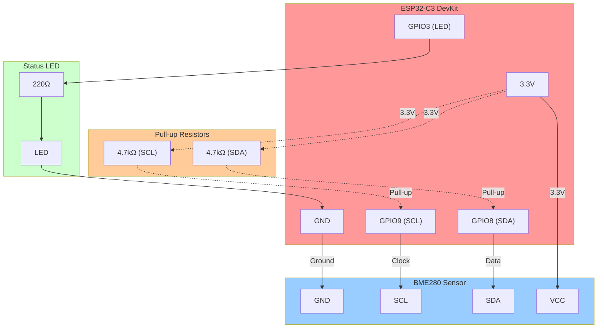
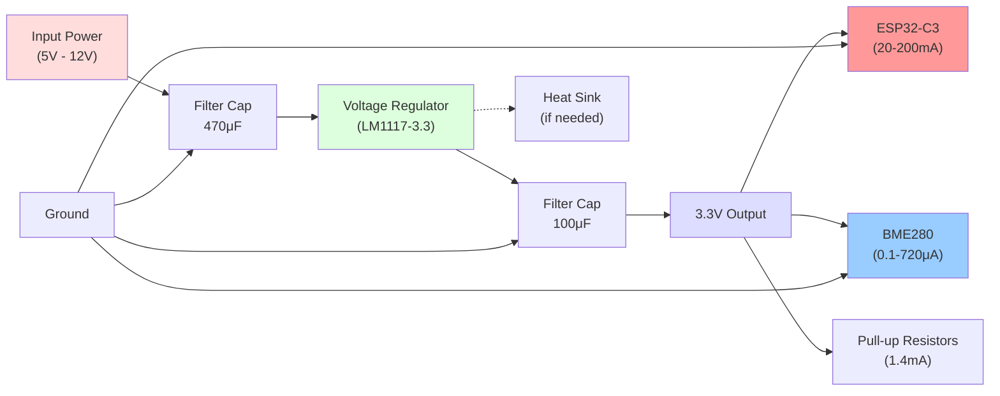

# Hardware Setup Guide

> Complete hardware setup and wiring guide for ESP32-C3 IoT Environmental Monitoring System

## Overview

This guide provides detailed instructions for setting up the hardware components of the ESP32-C3 IoT system, including wiring diagrams, component specifications, and troubleshooting tips.

## Components Required

### Essential Components

#### ESP32-C3 DevKit Board
- **Microcontroller**: ESP32-C3 (RISC-V single-core 160MHz)
- **Memory**: 384KB SRAM, 4MB Flash (minimum)
- **Connectivity**: WiFi 2.4GHz (802.11 b/g/n)
- **GPIO Pins**: 22 digital I/O pins
- **Power Supply**: 3.0V - 3.6V DC (via USB or external)
- **Operating Temperature**: -40°C to +85°C
- **Current Consumption**: ~200mA peak (during WiFi transmission)

#### BME280 Environmental Sensor Module
- **Measurements**: Temperature, Humidity, Atmospheric Pressure
- **Interface**: I2C (100kHz standard, 400kHz fast mode)
- **Supply Voltage**: 1.8V - 3.6V (3.3V recommended)
- **Current Consumption**: 3.4μA @ 1Hz sampling
- **Temperature Range**: -40°C to +85°C (±1°C accuracy)
- **Humidity Range**: 0-100% RH (±3% accuracy)
- **Pressure Range**: 300-1100 hPa (±1 hPa accuracy)

### Additional Components

#### Passive Components
- **Pull-up Resistors**: 2x 4.7kΩ (for I2C SDA and SCL lines)
- **Decoupling Capacitors**: 100nF + 10μF (for power supply filtering)
- **Status LED**: Standard 3mm LED + 220Ω current limiting resistor

#### Development Tools
- **USB Cable**: Data-capable USB Type-C or Micro-USB (depending on board)
- **Breadboard**: Half-size breadboard (recommended)
- **Jumper Wires**: Male-to-male and male-to-female
- **Multimeter**: For voltage verification and continuity testing

### Optional Components

#### Enhanced Setup
- **Logic Analyzer**: For I2C debugging (optional)
- **Oscilloscope**: For signal analysis (optional)
- **Power Supply**: External 3.3V regulated supply (for battery operation)
- **Enclosure**: IP65-rated enclosure for outdoor deployment
- **Antenna**: External 2.4GHz antenna for improved range

## Wiring Diagram

### Basic Connection Diagram



### Detailed Pin Assignments

| Function | ESP32-C3 Pin | BME280 Pin | Component | Notes |
|----------|--------------|------------|-----------|-------|
| **Power** | 3.3V | VCC | Power Supply | 3.3V regulated |
| **Ground** | GND | GND | Common Ground | Multiple GND pins available |
| **I2C Data** | GPIO8 | SDA | Data Line | Requires 4.7kΩ pull-up |
| **I2C Clock** | GPIO9 | SCL | Clock Line | Requires 4.7kΩ pull-up |
| **Status LED** | GPIO3 | - | LED Anode | Through 220Ω resistor |
| **LED Ground** | GND | - | LED Cathode | Direct connection |

### I2C Address Configuration

The BME280 sensor supports two I2C addresses:

| SDO Pin Connection | I2C Address | Typical Use |
|-------------------|-------------|-------------|
| **GND (Low)** | 0x76 | Primary address (default) |
| **VCC (High)** | 0x77 | Secondary address |

**Note**: Most BME280 breakout boards default to address 0x76. The software automatically detects both addresses.

## Step-by-Step Assembly

### Step 1: Prepare the Breadboard

1. **Place Components**:
   - Position ESP32-C3 DevKit on one side of breadboard
   - Place BME280 module on the opposite side
   - Leave space in the middle for wiring and components

2. **Verify Power Rails**:
   - Connect breadboard power rails to ESP32-C3 3.3V and GND
   - Use multimeter to verify 3.3V output when USB connected

### Step 2: Power Connections

1. **BME280 Power**:
   ```
   ESP32-C3 3.3V → BME280 VCC
   ESP32-C3 GND  → BME280 GND
   ```

2. **Verify Power**:
   - Connect ESP32-C3 to computer via USB
   - Measure voltage at BME280 VCC pin (should be 3.3V ±0.1V)
   - Check for stable voltage (no significant ripple)

### Step 3: I2C Signal Connections

1. **Data Line (SDA)**:
   ```
   ESP32-C3 GPIO8 → BME280 SDA
   ```

2. **Clock Line (SCL)**:
   ```
   ESP32-C3 GPIO9 → BME280 SCL
   ```

3. **Critical**: Do not connect pull-up resistors yet

### Step 4: Pull-up Resistors

I2C requires pull-up resistors for proper operation:

1. **SDA Pull-up**:
   ```
   4.7kΩ resistor: 3.3V → GPIO8 (SDA line)
   ```

2. **SCL Pull-up**:
   ```
   4.7kΩ resistor: 3.3V → GPIO9 (SCL line)
   ```

3. **Verification**:
   - With no I2C traffic: SDA and SCL should read 3.3V
   - During communication: Signals should swing between 0V and 3.3V

### Step 5: Status LED (Optional)

1. **LED Connection**:
   ```
   ESP32-C3 GPIO3 → 220Ω resistor → LED anode
   LED cathode → GND
   ```

2. **LED Test**:
   - Flash basic blinky firmware
   - Verify LED blinks at expected rate

### Step 6: Final Verification

1. **Visual Inspection**:
   - Check all connections match wiring diagram
   - Verify no short circuits between power and ground
   - Ensure proper polarity on LED and power connections

2. **Electrical Testing**:
   - Measure resistance between 3.3V and GND (should be >1MΩ)
   - Test continuity on all signal paths
   - Verify pull-up resistor values (4.7kΩ ±5%)

## Power Supply Considerations

### USB Power (Development)

- **Voltage**: 5V input, regulated to 3.3V on-board
- **Current Capacity**: Typically 500mA (USB 2.0)
- **Pros**: Convenient for development, provides serial communication
- **Cons**: Requires computer connection, not suitable for deployment

### External 3.3V Supply (Production)

For battery-powered or standalone operation:

#### Specifications
- **Voltage**: 3.3V ±5% (3.135V - 3.465V)
- **Current Capacity**: Minimum 500mA (1A recommended)
- **Ripple**: <50mV peak-to-peak
- **Load Regulation**: <3% from no-load to full-load

#### Recommended Power Supplies
- **LM1117-3.3**: Linear regulator for <800mA applications
- **AMS1117-3.3**: Low-dropout linear regulator
- **Buck Converter**: Switching regulator for >1A applications
- **Battery + LDO**: For portable applications

#### Power Supply Circuit



### Power Consumption Analysis

| Component | Operating Mode | Current Draw | Notes |
|-----------|----------------|--------------|-------|
| **ESP32-C3** | Deep Sleep | 5μA | WiFi off, CPU off |
| **ESP32-C3** | Light Sleep | 750μA | WiFi off, CPU on |
| **ESP32-C3** | Active (WiFi off) | 20mA | CPU active, no RF |
| **ESP32-C3** | WiFi Connected | 80mA | Average with periodic activity |
| **ESP32-C3** | WiFi TX Peak | 200mA | Peak during transmission |
| **BME280** | Measurement | 720μA | During active measurement |
| **BME280** | Sleep | 0.1μA | Between measurements |
| **Pull-up Resistors** | Always | 1.4mA | 3.3V / 4.7kΩ × 2 |

**Total System**: 85-205mA during normal operation

## Signal Quality and Integrity

### I2C Signal Requirements

#### Electrical Characteristics
- **VIL (Input Low)**: 0V to 0.99V
- **VIH (Input High)**: 2.31V to 3.3V
- **VOL (Output Low)**: 0V to 0.4V
- **Rise Time**: <1000ns (100kHz), <300ns (400kHz)
- **Fall Time**: <300ns
- **Setup Time**: >250ns
- **Hold Time**: >0ns

#### Signal Quality Checklist
- [ ] Clean 0V to 3.3V signal swing
- [ ] No overshoot or undershoot >10%
- [ ] Rise/fall times within specification
- [ ] No ringing or oscillation
- [ ] Stable logic levels during hold times

### Noise Reduction Techniques

#### Power Supply Filtering
```
3.3V Rail: 10μF electrolytic + 100nF ceramic (close to each IC)
```

#### Ground Plane
- Use solid ground connections
- Minimize ground loop area
- Keep digital and analog grounds together at single point

#### Signal Routing
- Keep I2C traces short (<10cm for 100kHz)
- Route SDA and SCL together
- Avoid crossing high-frequency signals
- Use ground guard traces for sensitive signals

## Troubleshooting Hardware Issues

### Power Issues

#### No Power to ESP32-C3
**Symptoms**: No LED indicators, no USB enumeration

**Checks**:
```bash
# Verify USB cable carries data (not charging-only)
lsusb | grep -i espressif

# Check power LED on development board
# Measure voltage at 3.3V pin with multimeter
```

**Solutions**:
- Try different USB cable
- Test different USB port or hub
- Check for short circuits on board

#### Unstable Power Supply
**Symptoms**: Random resets, WiFi connection failures

**Checks**:
- Measure 3.3V rail under load
- Check for voltage drops during WiFi transmission
- Verify adequate decoupling capacitors

**Solutions**:
- Add 470μF capacitor on 3.3V rail
- Use external regulated power supply
- Check USB cable and port current capacity

### I2C Communication Issues

#### BME280 Not Detected
**Symptoms**: I2C timeouts, sensor not found errors

**Diagnostic Steps**:
```bash
# Check I2C address detection
i2cdetect -y 1  # Linux with I2C tools

# Verify pull-up resistors
# Measure 3.3V on SDA and SCL when idle
```

**Hardware Checks**:
- [ ] Pull-up resistors installed (4.7kΩ)
- [ ] SDA/SCL not swapped
- [ ] No short circuits to ground or power
- [ ] BME280 power supply stable
- [ ] Proper I2C address configuration

#### Intermittent I2C Errors
**Symptoms**: Occasional communication failures

**Checks**:
- Signal integrity with oscilloscope
- Noise on power supply
- Temperature-related issues
- Mechanical connections

**Solutions**:
- Reduce I2C clock speed to 100kHz
- Add ferrite beads on power lines
- Improve grounding and shielding
- Use shorter, twisted pair wires

### GPIO and LED Issues

#### Status LED Not Working
**Symptoms**: LED never lights or stays always on

**Checks**:
- LED polarity (anode to GPIO3, cathode to GND)
- Current limiting resistor value (220Ω)
- GPIO3 output voltage (0V/3.3V switching)
- LED forward voltage drop (~2V for red LED)

**Solutions**:
- Verify LED is not damaged (test with 3.3V + resistor)
- Check resistor value and connections
- Test GPIO3 with multimeter or oscilloscope

### Environmental Considerations

#### Temperature Effects
- **Operating Range**: -40°C to +85°C for both components
- **Storage Range**: -40°C to +125°C
- **Thermal Management**: Ensure adequate ventilation
- **Calibration**: BME280 may need temperature offset in extreme conditions

#### Humidity Effects
- **Relative Humidity**: 0-100% RH operational
- **Condensation**: Avoid water droplet formation on electronics
- **Enclosure**: Use IP65-rated enclosure for outdoor deployment
- **Ventilation**: Ensure sensor exposure to ambient air

#### Mechanical Considerations
- **Vibration**: Secure all connections for mobile applications
- **Strain Relief**: Prevent cable stress on connectors
- **Mounting**: Use proper standoffs and mounting hardware
- **Accessibility**: Maintain access for programming and debugging

## Production Considerations

### PCB Design Guidelines

#### Layout Recommendations
- **Component Placement**: Keep ESP32-C3 and BME280 close together
- **Power Planes**: Use solid 3.3V and ground planes
- **Trace Width**: Minimum 0.2mm for signal traces, 0.5mm for power
- **Via Size**: 0.2mm minimum drill, 0.45mm pad
- **Clearance**: 0.15mm minimum between traces

#### EMC Considerations
- **Ground Plane**: Continuous ground plane under high-speed signals
- **Decoupling**: 100nF ceramic capacitors at each IC power pin
- **Filtering**: LC filter on power input for conducted emissions
- **Shielding**: Consider RF shield over ESP32-C3 for sensitive applications

### Manufacturing Testing

#### Automated Test Points
- **Power**: 3.3V, GND test points
- **I2C**: SDA, SCL test points for protocol analysis
- **GPIO**: LED control test point
- **Programming**: UART TX/RX test points

#### Production Test Sequence
1. **Power-On Test**: Verify 3.3V supply
2. **I2C Test**: Detect BME280 at correct address
3. **Sensor Test**: Read calibration data and test measurement
4. **WiFi Test**: Verify WiFi hardware detection
5. **Functional Test**: Complete system operation test

#### Quality Assurance
- **Burn-in Testing**: 24-48 hour operation test
- **Temperature Cycling**: -20°C to +70°C cycles
- **Vibration Testing**: 10-2000Hz for mobile applications
- **EMC Testing**: Emissions and immunity testing per regulations

This hardware guide provides comprehensive information for building reliable, production-quality ESP32-C3 IoT systems with proper signal integrity, power management, and manufacturing considerations.